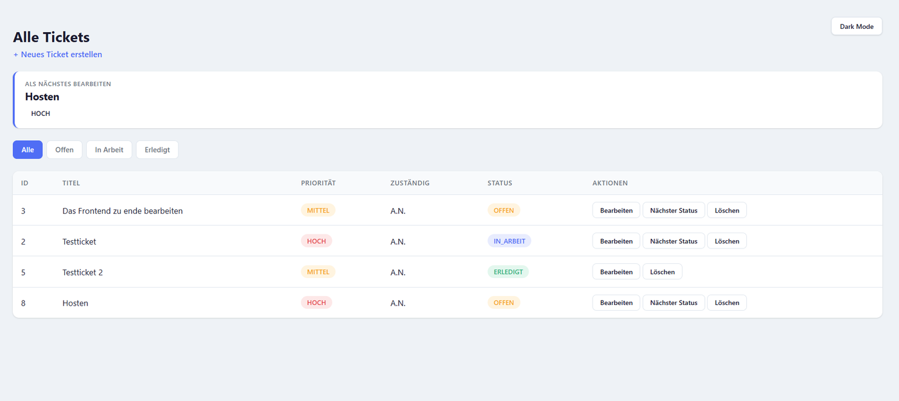
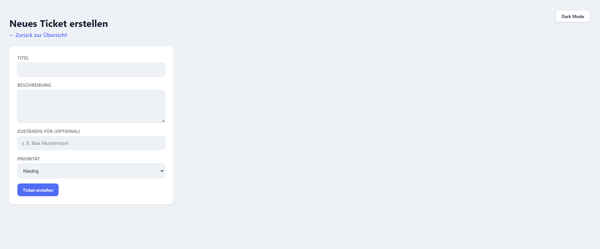
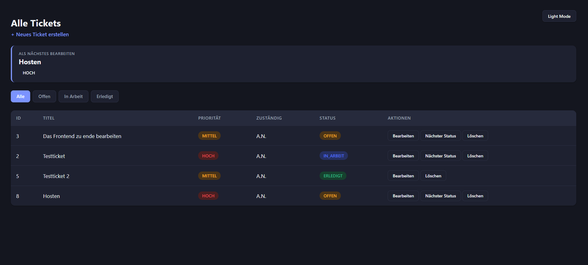

# MiniTicketSystem

A simple ticket/task management system built with Spring Boot, featuring a REST API and a server-rendered web frontend. Built as a learning project to practice Java, Spring Boot, and clean layered architecture.

## Screenshots

**Ticket overview with priority-based "next up" card and status filters**


**Creating a new ticket**


**Dark mode**


## Features

- Create, view, edit, and delete tickets
- Status workflow: `OFFEN` → `IN_ARBEIT` → `ERLEDIGT`, advanced with a single click
- Priority levels (`NIEDRIG`, `MITTEL`, `HOCH`) with color-coded badges
- Optional assignee field per ticket
- "Next ticket to work on" card, always showing the highest-priority open ticket — recalculated fresh on every request, so newly created high-priority tickets are picked up immediately
- Filter tickets by status via tabs
- Dark / light mode toggle (persisted via `localStorage`)
- Responsive layout (card view on mobile)
- Centralized error handling with clean JSON error responses on the REST API
- Both a REST API (`/api/tickets`) and a server-rendered web UI

## Tech Stack

- **Java 17**
- **Spring Boot 4** (Web, Data JPA)
- **PostgreSQL**
- **Thymeleaf** (server-rendered templates)
- **Maven**
- Vanilla CSS and JavaScript (no frontend framework)

## Architecture

The project follows a classic layered architecture:

```
Controller → Service → Repository → Database
```

- **`controller`** — REST endpoints (`TicketController`) and web/Thymeleaf endpoints (`TicketWebController`), plus a global exception handler
- **`service`** — business logic (e.g. determining the next ticket to work on by priority)
- **`repository`** — Spring Data JPA repository for database access
- **`model`** — the `Ticket` entity plus `TicketStatus` and `TicketPriority` enums

**Project structure:**

```
MiniTicketSystem/
├── docs/screenshots/
├── src/main/java/com/vampirenoob/ticketsystem/
│ ├── controller/
│ ├── service/
│ ├── repository/
│ └── model/
├── src/main/resources/
│ ├── templates/ (Thymeleaf views)
│ └── static/ (CSS, JS, favicon)
├── pom.xml
```

## Getting Started

### Prerequisites

- Java 17
- Maven (or use the included `mvnw` wrapper)
- PostgreSQL running locally

### Setup

1. Create a PostgreSQL database named `ticketsystem`.
2. Copy `src/main/resources/application.properties.example` to `src/main/resources/application.properties` and fill in your local database credentials.
3. Run the application:

```bash
   ./mvnw spring-boot:run
```

4. Open `http://localhost:8080` in your browser.

### REST API

The REST API is available under `/api/tickets` and supports the standard operations (`GET`, `POST`, `PATCH`, `DELETE`), including a `GET /api/tickets/next` endpoint that returns the highest-priority open ticket.

## Cloud hosting — considered, deliberately not pursued

Cloud hosting was evaluated but consciously left out of scope for this version:

- Netlify only handles static sites and JavaScript functions — it can't run a Java/Spring Boot process at all, so it was never an option.
- Render's free tier spins down after 15 minutes of inactivity, and its free PostgreSQL database expires after 30 days — not a lasting fit for a project meant to stay reliably viewable.
- A separate managed PostgreSQL provider (e.g. Neon) would solve the database side, but would mean juggling yet another provider and connection setup for a project this small, on top of the ones already used for other portfolio pieces.

Running locally (PostgreSQL + `./mvnw spring-boot:run`) turned out to be the more practical fit for this stage: no hosting limitations, no added infrastructure to maintain, and the project's purpose — demonstrating a clean Spring Boot layered architecture — is fully served by that. Anyone curious is welcome to clone the repo and run it themselves.

## Possible Next Steps

- User accounts / authentication, so assignees are real users instead of free text
- Sorting by column in the ticket table
- Deployment to a cloud host

## Contact

Feel free to reach out via GitHub or Instagram:

- GitHub: [@VampireNoob](https://github.com/VampireNoob)
- Instagram: [@vampirenoob](https://instagram.com/vampirenoob)